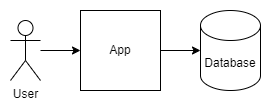

# TODO Application With Perfect Architecture



That's it!

- **Frontend**: Svelte 5, TailwindCSS, and DaisyUI.
- **Backend**: PostgreSQL 17 with an auto-generated REST API (via NpgsqlRest).
- **Deployment**: Fully Dockerized, including build and watch processes. Local builds are also supported with the Bun runtime.

## Installation

You can use degit to clone this repo as a template:. Degit copies repo without repo intialization.

```console
$ bun install -g degit
bun add v1.2.8 (adab0f64)

installed degit@2.8.4 with binaries:
 - degit

1 package installed [980.00ms]
$ degit vb-consulting/NpgsqlRestTodo my_project
> cloned vb-consulting/NpgsqlRestTodo#HEAD to my_project
$ cd my_project
$ code .
```

You can also click big green button "Use this template" in the upper right corner of the GitHub.

Note: Install recommended extensions for VS Code and use task explorer to run tasks!

## Running Commands

Tasks are organized into 8 categories (see `tasks.json` for details):

- **app**: Build, watch, or refresh autogenerated application files.
- **bun**: Update Bun or upgrade packages.
- **db**: Local database commands (e.g., dump schema, run migrations, or test). Requires local `pgmigrations` and PostgreSQL client.
- **dockerdb**: Start the database container (dev or prod, detached or interactive).
- **dockerdev**: Run everything in Docker with the app in watch mode (uses Rollup in `/src/`).
- **dockerlocal**: Run everything in Docker except the app—use local build/watch commands instead.
- **dockermigrations**: Dockerized database commands (e.g., dump, migrate, test)—no local tools needed.
- **dockerprod**: Build or run a production-ready Docker image (minified, no watch mode).

## Application

## Database

## Directory Structure

```
NpgsqlRestTodo/
│
├── .vscode/                     # VS Code configuration
│
├── backend/                     # PostgreSQL database migrations and code
│   ├── 00__pre_sys/             # System prerequisites
│   ├── 10__public/              # Public schema objects
│   ├── 20__post_sys/            # Post-system setup
│   ├── 30__logs/                # Logging tables and functions
│   ├── 40__app/                 # Application logic
│   ├── 50__auth/                # Authentication logic
│   │   └── private/             # Private authentication functions
│   │
│   └── TESTS/                   # Database tests
│
├── config/                      # Configuration files
│
├── dist/                        # Build output directory (empty in repo)
│
├── http/                        # Auto-generated HTTP request examples for testing
│
├── src/                         # Frontend source code
│   ├── api/                     # Auto-generated API clients
│   │
│   ├── app/                     # Application code
│   │   ├── lib/                 # Library code
│   │   └── part/                # UI components
│   │
│   ├── assets/                  # Static assets
│   │   └── confirm/             # Email confirmation assets
│   │
│   └── style/                   # CSS styles
│
└── worker/                      # Background job worker
    └── queue_modules/           # Job processors
```


## Troubleshooting

- **Permissions Issue for `dist` on Linux**: After Docker builds, local builds may fail due to permissions. Fix with:
```bash
sudo chown -R $(whoami) ./dist/
```

- **CORS Policy Issue on WSL**: WSL defaults to http://localhost:5000, causing CORS errors. Use http://127.0.0.1:5000 instead, as the API expects requests from this address.

- **WSL Docker Watching Issues**: File watching may fail in Docker on WSL. Set this environment variable in `./config/docker-compose.dev.yml` under the `rollup-watch` service:
```
ENABLE_POLLING=true
```

## Got Questions?

Take them to a [discussion board](https://github.com/vb-consulting/NpgsqlRestTodo/discussions).

## Licence

[MIT License](https://github.com/vb-consulting/NpgsqlRestTodo/blob/master/LICENSE) let's you do anyhting.

## Say Thank You

Also at [discussion board](https://github.com/vb-consulting/NpgsqlRestTodo/discussions).