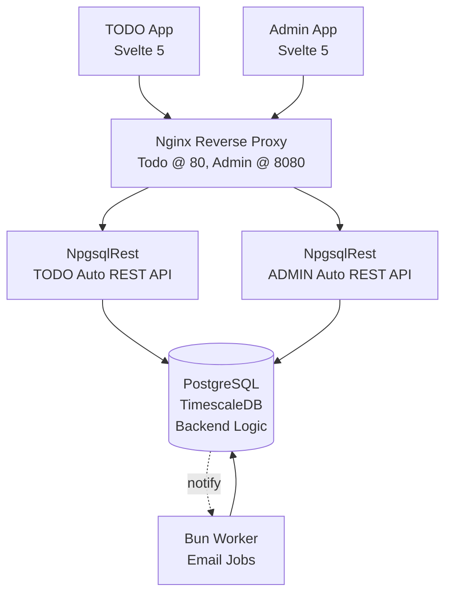

# TODO Application PostgreSQL Template

This is a complete template application, implementing a simple TODO feature, for modern development based on PostgreSQL with security and scalability features and capabilities, and automatic REST API provided by NpgsqlRest application client.

This is a **production template**. The entire purpose of TODO part (which isn't event finished yet) is to be replaced with something else. This project also serves as a **proof of concept** and **component library**.

## Features:

- **Fully Dockerized Environment**: Services for local development, dockerized development, and production.
- **High Availability PostgreSQL Image From TimescaleDB**: Docker image with the latest PostgreSQL and TimescaleDB (from Timescale) with hundreds of curated extensions available for high availability. 
- **Automated Audit Fields**: A system for automatic audit field management that enforces consistent tracking of who changed what and when, by populating and maintaining standard metadata fields across all tables.
- **Temporal Table System**: A complete system for temporal table support provides built-in mechanisms to store, query, and manage data across different points in time, enabling accurate historical tracking, auditing, and time-based analysis of changes to data.
- **Least-Privilege Security System**: A principle-of-least-privilege system where each application connects using narrowly scoped permissions, limiting access to only the operations and data it requires which enables another level of security hardening.
- **PostgreSQL User-Defined Functions and Stored Procedures As Backend**: A complete implementation of (almost) entire backend as PostgreSQL User-Defined Functions and Stored Procedures. Only sending emails is dedicated to a Worker component.
- **Unit Tests Coverage**: Comprehensive PostgreSQL unit testing framework covering all business logic, authentication flows, and data validation with automated test execution during migration process and CI/CD integration.
- **Automatic REST API Generated from PostgreSQL**: NpgsqlRest client service automatically creates high-speed REST API endpoints from PostgreSQL User-Defined Functions and Stored Procedures metadata using simple and declarative comment annotations.
- **Automatic Typescript Fetch Modules**: NpgsqlRest client service in development mode generates Typescript fetch modules automatically, based on the previously generated REST API endpoints.
- **Automatic HTTP Files**: NpgsqlRest client service in development mode generates HTTP files for testing and development with Visual Studio tools and extensions.
- **Cookie-Based Authentication**: Cookie-Based authentication which uses encrypted cookies that are persistent, even after service restart or redeployment.
- **Cached-claims and Persistent User Info**: User authentication state and role information cached in encrypted cookies with PostgreSQL session context injection, providing instant access to user identity and permissions without database queries.
- **Role-based Access Control**: Flexible role system with configurable default assignments, hierarchical permissions, and automatic endpoint authorization based on user roles stored as arrays in session context.
- **External Auth Providers**: Integrated OAuth support for Google, LinkedIn, and Microsoft with automatic user creation, provider data storage as JSONB, and seamless fallback to local authentication.
- **High-Speed Structural Logging**: High-speed structural logging based on Serilog logging system that logs data to console, rolling file and TimescaleDB enabled hypertable in database.
- **Worker Service**: JavaScript Bun worker component services for processing queued jobs and responding to NOTIFY signals to initiate immediate jobs. Currently used only for authentication emails (confirmation, reset, etc).
- **Separated Application and Administration Services**: By physically separating the administration application from the main application, changes in administration can be deployed separately, avoiding any potential interruption. In production setup, it is exposed on separate port 8080.
- **Dockerized PgBouncer Production Services**: PgBouncer connection pooler running in a lightweight Docker container, serving all applications and services, each with its own database user, to ensure connection scalability.
- **Dockerized Nginx Production Service**: A containerized instance of the Nginx reverse proxy web server serving static content for all applications.
- **Svelte 5 Compiler**: Svelte 5 compiler for building beautiful, fast and modern web pages.
- **TypeScript Type System**: TypeScript used for advanced type checking, especially for automatically generated code.
- **Dockerized Bun Based Build System**: Entire frontend build system based on Bun runtime, either dockerized or local environment.
- **Latest DaisyUI 5 Framework**: Latest DaisyUI 5 Tailwind-based component system with theme support.
- **Lucide Icons**: Latest Lucide icons suite from https://lucide.dev/icons/

## System Diagram:



## PostgreSQL Static Type Checking and Automatic API

This project uses NpgsqlRest to automatically generate REST API endpoints from PostgreSQL functions with strong typing throughout the stack.

### How It Works

On every build:

1) Migration process keeps all User-Defined Functions and Stored Procedures up-to-date with repeatable migrations in source code.
2) NpgsqlRest process starts, it exposes API endpoints and generates TypeScript code modules with appropriate types.
3) Build process runs for Svelte TypeScript project. It will break if there is a type mismatch.

Project is statically checked.

### Example

**1. PostgreSQL Function**
```sql
-- Simple function returning TODO items
create function todo.get_items(
    _search text
)
returns setof todo.items
language sql
security definer
as 
$$
select 
    id, title, completed, user_id
from 
    todo.items 
where 
    user_id = _.user_id() 
    and (
        _search is null or title ilike _search
    );
$$;

-- Annotation to expose as REST endpoint
call _.annotate(
    'todo.get_items', 
    'HTTP GET',
    'Authorize'
);
```

**2. Generated REST Endpoint**
- `GET /api/todo/get-items?search={_search}`

**3. Auto-generated TypeScript Interface**
```typescript
// autogenerated at 2025-08-01T10:41:40.6971491+00:00

interface ITodoGetItemsRequest {
    search: string | null;
}

interface ITodoGetItemsResponse {
    id: number | null;
    title: string | null;
    completed: boolean | null;
    userId: number | null;
}
```

**4. Auto-generated TypeScript Fetch Function**
```typescript
/**
* function todo.get_items(
*     _search text
* )
* returns table(
*     id bigint,
*     title text,
*     completed boolean,
*     user_id bigint
* )
* 
* @remarks
* comment on function todo.get_items is 'HTTP GET
* Authorize';
* 
* @param {ITodoGetItemsRequest} request
* @returns {{status: number, response: ITodoGetItemsResponse[] | string}}
* 
* @see FUNCTION todo.get_items
*/
export async function todoGetItems(
    request: ITodoGetItemsRequest
) : Promise<{status: number, response: ITodoGetItemsResponse[] | string}> {
    const response = await fetch(todoGetItemsUrl(request), {
        method: "GET",
        headers: {
            "Content-Type": "application/json"
        },
    });
    return {
        status: response.status,
        response: response.status == 200 ? await response.json() as ITodoGetItemsResponse[] : await response.text()
    };
}
```

**5. Generated HTTP File for Testing**
```http
@host=http://0.0.0.0:8080

// function todo.get_items(
//     _search text
// )
// returns table(
//     id bigint,
//     title text,
//     completed boolean,
//     user_id bigint
// )
//
// comment on function todo.get_items is 'HTTP GET
// Authorize';
GET {{host}}/api/todo/get-items?search=ABC
```

The entire API layer is generated automatically from PostgreSQL function signatures, providing end-to-end type safety from database to frontend.

## Project Structure

```
NpgsqlRestTodo/
│
├── .vscode/                         # VS Code workspace configuration
│   ├── extensions.json              # VS Code Recommended extensions for this project
│   ├── settings.json                # VS Code settings for this project
│   └── tasks.json                   # VS Code tasks definitions (build and development) for running in VS Code
│
├── config/                          # Configuration files and build settings
│   ├── build/                       # Rollup build configuration for frontend builds
│   │   ├── Dockerfile               # Rollup container for dockerized builds
│   │   ├── rollup.build.js          # Main rollup build script, builds all files for root path in parameter
│   │   ├── rollup.config.js         # Default rollup configuration
│   │   └── rollup.shared.js         # Shared rollup settings
│   ├── migrations/                  # Database migration configuration
│   │   ├── Dockerfile               # Migration container
│   │   ├── pgmigrations.js          # Production migration config
│   │   └── pgmigrations.local.js    # Local migration configuration, used locally without docker
│   ├── nginx/                       # NGINX reverse proxy configuration
│   │   ├── conf.d/                  # Site-specific configurations
│   │   │   ├── admin.conf           # Administraton application web server configuration, exposed at 8080 port
│   │   │   └── default.conf         # Default application web server configuration, exposed at default port
│   │   └── nginx.conf               # Main NGINX configuration
│   ├── npgsqlrest/                  # NpgsqlRest API server settings
│   │   ├── admin-settings.json      # Admin application configuration
│   │   ├── app-settings.json        # App application configuration
│   │   ├── base-settings.json       # Shared base application configuration
│   │   └── dev-settings.json        # Development configuration overrides
│   ├── services/                    # Docker Compose service definitions
│   │   ├── docker-compose.*.local.yml # Local environment specific service compositions for app and admin separately
│   │   ├── docker-compose.*.dev.yml # Dockerized development environment specific service compositions for app and admin separately
│   │   ├── docker-compose.prod.yml  # Production environment-specific service compositions
│   │   └── service.*.yml            # Individual service configurations
│   └── .env                         # Main environment file with application settings
│
├── src/                             # Source code
│   ├── _lib/                        # Shared library components
│   │   ├── analytics.ts             # Function to get browser analytics 
│   │   ├── api.ts                   # Wrapper over fetch server calls, with toast notifications and status code handling
│   │   ├── Dialog.svelte            # Reusable dialog Svelte component
│   │   ├── env.ts                   # Auto-generated environment settings by build process
│   │   ├── urls.ts                  # Url parameter parser function
│   │   ├── user.ts                  # User info global store
│   │   ├── *.svelte                 # Other Svelte reusable UI components (Layouts, Toast, etc.)
│   │   └── *.ts                     # Other shared utility function modules (generate id, sanitaze input, etc.)
│   │
│   ├── admin/                       # Administration application
│   │   ├── api/                     # Auto-generated API client code - fetch-modules and type interfaces
│   │   │   ├── env.ts               # Auto-generated envioremnt for admin application by build process
│   │   │   ├── *.d.ts               # Auto-generated type interfaces for fetch modules
│   │   │   └── *.ts                 # Auto-generated fetch modules
│   │   ├── assets/                  # Static assets for admin app, copied and parsed into dist dir on build
│   │   │   ├── index.html           # Index HTML page, references index.js in build (dist) output
│   │   │   ├── user_template.js     # User template, parsed by server, replaces placholders with user information
│   │   │   └── *.*                  # All other static resource for admin application that are copied and parsed to build (dist) output
│   │   ├── pages/                   # Admin page Svelte components
│   │   │   ├── Index.svelte         # Index page Svelte component containing logic, markup, styling, etc, referenced by admin/index.ts
│   │   │   └── *.svelte             # Other Svelte components
│   │   ├── style/                   # Admin-specific styles
│   │   │   ├── style.css            # Main CSS styling entry point for the admin build, providing Tailwind/DaisyUI theming
│   │   │   └── *.css                # Other CSS specific modules
│   │   ├── index.ts                 # Index page entry module
│   │   └── *.ts                     # Other page entry modules
│   │
│   ├── app/                         # Main TODO application
│   │   ├── api/                     # Auto-generated API client code - fetch-modules and type interfaces
│   │   │   ├── env.ts               # Auto-generated envioremnt for admin application by build process
│   │   │   ├── *.d.ts               # Auto-generated type interfaces for fetch modules
│   │   │   └── *.ts                 # Auto-generated fetch modules
│   │   ├── assets/                  # Static assets for todo app, copied and parsed into dist dir on build
│   │   │   ├── index.html           # Index HTML page, references index.js in build (dist) output
│   │   │   ├── user_template.js     # User template, parsed by server, replaces placholders with user information
│   │   │   └── *.*                  # All other static resource for todo application that are copied and parsed to build (dist) output
│   │   ├── pages/                   # TODO page Svelte components
│   │   │   ├── Index.svelte         # Index page Svelte component containing logic, markup, styling, etc, referenced by todo/index.ts
│   │   │   └── *.svelte             # Other Svelte components
│   │   ├── style/                   # TODO app-specific styles
│   │   │   ├── style.css            # Main CSS styling entry point for the todo app build, providing Tailwind/DaisyUI theming
│   │   │   └── *.css                # Other CSS specific modules
│   │   ├── index.ts                 # Index page entry module
│   │   └── *.ts                     # Other page entry modules
│   │
│   └── backend/                     # PostgreSQL database schema and logic
│       ├── 0__system/               # Core system functions and utilities
│       ├── 1__temporal/             # Temporal table system implementation
│       ├── 2__public/               # Public schema tables (versioned migrations)
│       ├── 3__logs/                 # Logging tables (versioned migrations) in separate log schema for separated backups
│       ├── 4__app/                  # Application utility functions (logging, jobs, etc)
│       ├── 5__auth/                 # Authentication system
│       │   ├── private/             # Internal auth functions and types
│       │   └── public/              # Public-facing auth endpoints
│       ├── 6__profile/              # User profile functionality
│       ├── 7__todo/                 # TODO business logic functions
│       ├── TESTS/                   # Database unit tests
│       └── __scrap/                 # Development and testing scripts
│
├── worker/                          # Background job processing service
│   ├── queue_modules/               # Job processor implementations
│   │   ├── EmailConfirmation.js    # Email confirmation job handler
│   │   └── EmailReset.js            # Password reset email handler
│   ├── Dockerfile                   # Worker service container
│   ├── index.js                     # Main worker entry point
│   └── *.js                         # Worker utilities (db, log, queue)
│
├── admin_dist/                      # Built admin application files (git ignored)
├── app_dist/                        # Built main application files (git ignored)
├── http/                            # HTTP request examples for testing
├── logs/                            # Application log files (git ignored)
│
├── package.json                     # Node.js dependencies and scripts
├── tsconfig.json                    # TypeScript configuration
└── bun.lock                         # Bun package lock file
```

## Migration System

This project uses [pgmigrations](https://github.com/vb-consulting/pgmigrations) for database schema management with a file naming convention that supports different migration types and execution orders.

### File Naming Convention

The migration system uses prefixes to determine execution behavior:

| Prefix | Type | Description | Example |
|--------|------|-------------|---------|
| `V[n]__` | Versioned | Run once in order, tracked in migration table | `V1__table__users.sql` |
| `U[n]__` | Undo | Rollback migrations (reverse of versioned) | `U1__table__users.sql` |
| `R__` | Repeatable | Run when file content changes, after versioned migrations | `R__func__get_user.sql` |
| `_R__` | Repeatable Before | Run when file content changes, before versioned migrations | `_R__init.sql` |
| `_B__` | Before Always | Run before all migrations, every time | `_B__init_always.sql` |
| `_A__` | After Always | Run after all migrations, every time | `_A__after_always.sql` |

Migrations are organized in directories and ordered for execution same as Visual Studio Code Explorer would (natural order).

## Docker Deployment Configuration

The project provides multiple Docker Compose configurations optimized for different development workflows and deployment environments:

### Development Configurations

| Configuration | Purpose | Frontend Build | Backend Services | Use Case |
|---------------|---------|----------------|------------------|----------|
| **app.local** | Hybrid local/Docker setup | Local Bun build process | Dockerized (DB, API, Worker) | Frontend development with local tooling |
| **admin.local** | Hybrid local/Docker setup | Local Bun build process | Dockerized (DB, API, Worker) | Admin panel development with local tooling |
| **app.dev** | Full containerization | Dockerized Rollup with hot reload | Dockerized (DB, API, Worker) | Complete Docker development environment |
| **admin.dev** | Full containerization | Dockerized Rollup with hot reload | Dockerized (DB, API, Worker) | Complete Docker admin development |

### Production Configuration

| Configuration | Purpose | Frontend Build | Backend Services | Use Case |
|---------------|---------|----------------|------------------|----------|
| **prod** | Production deployment | Optimized Docker builds | Production services with networking | Production deployment with NGINX |

### Key Differences

**Local (.local) vs Dev (.dev):**
- **Local**: Runs frontend build process on host machine using local Bun installation, faster iteration
- **Dev**: Runs everything in containers including Rollup build with file watching, consistent environment

**App vs Admin:**
- **App**: Main TODO application service (port 8080)
- **Admin**: Administration panel service (port 8081)

**Production (prod):**
- Includes optimized frontend builds
- Adds NGINX reverse proxy
- Uses production networking configuration
- Includes both app and admin services

### Service Architecture

All configurations include:
- **PostgreSQL**: Database with TimescaleDB extensions
- **Migrations**: Automatic database schema management
- **NpgsqlRest**: Auto-generated REST API
- **Worker**: Background job processing (emails, notifications)

Choose the configuration that best matches your development workflow and deployment requirements.

## Troubleshooting

- **Permissions Issue on Linux**: After Docker builds, local builds may fail due to permissions. Fix with:
```bash
sudo chown -R $(whoami) ./
```

- **CORS Policy Issue on WSL**: WSL defaults to http://localhost:8080, causing CORS errors. Use http://127.0.0.1:8080 instead, as the API expects requests from this address.

- **WSL Docker Watching Issues**: File watching may fail in Docker on WSL. Set this environment variable in `./config/docker-compose.dev.yml` under the `rollup-watch` service:
```yaml
environment:
  - ENABLE_POLLING=true
```

- **Docker Volume Permissions**: If you encounter permission issues with Docker volumes, make sure the volumes have appropriate permissions:
```bash
docker-compose down -v && docker-compose up
```

## Contributing

Contributions are welcome! Please feel free to submit a Pull Request.

## Questions and Support

If you have questions or need assistance, please visit the [discussion board](https://github.com/vb-consulting/NpgsqlRestTodo/discussions).

## License

This project is licensed under the [MIT License](https://github.com/vb-consulting/NpgsqlRestTodo/blob/master/LICENSE), which allows you to use, copy, modify, merge, publish, distribute, sublicense, and/or sell copies of the software.

## Acknowledgements

If you find this project useful, please consider giving it a star on GitHub and sharing your feedback on the [discussion board](https://github.com/vb-consulting/NpgsqlRestTodo/discussions).
